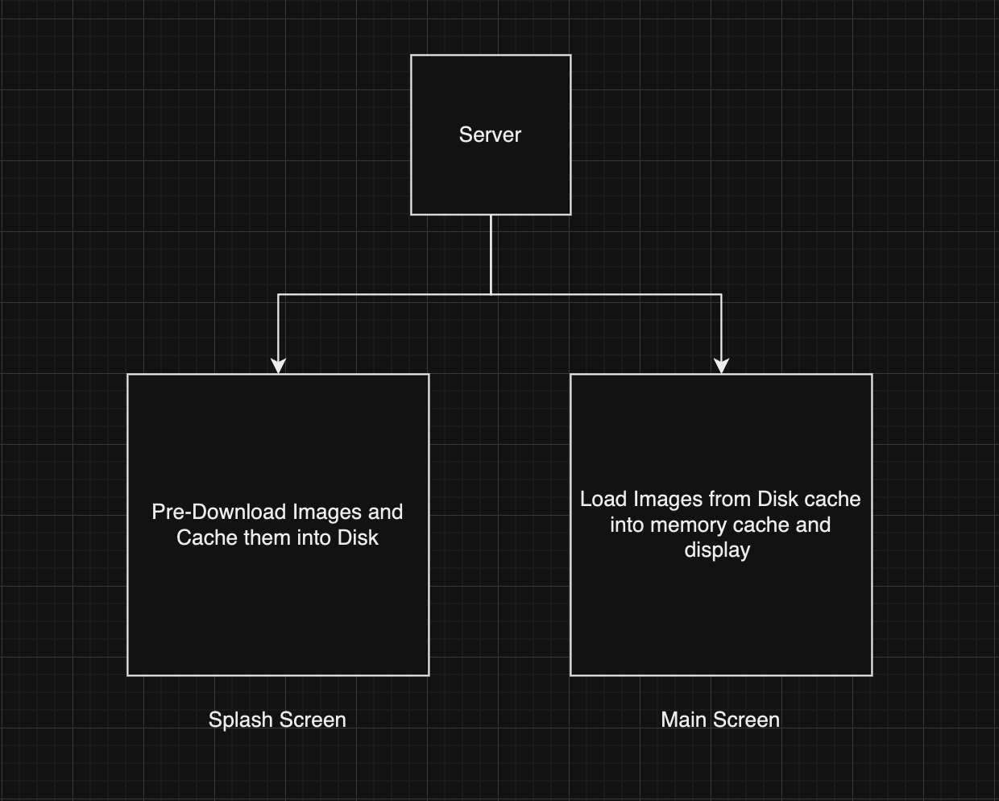
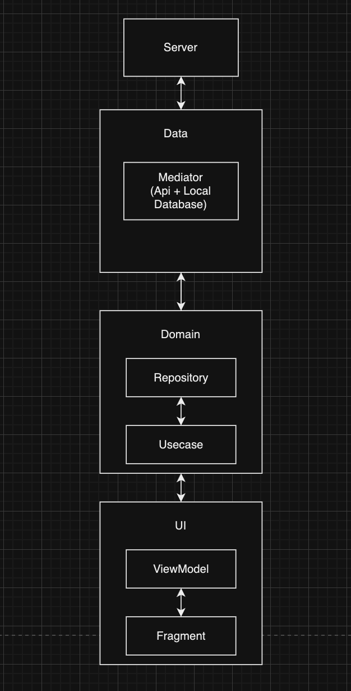

<h1>ImageLoaderX</h1>
<h3>An Android Application showcasing an Asynchronous Image Loading Library and Pagination along with Clean Architecture along with Caching</h3>
Video Demonstration : https://drive.google.com/file/d/1fqivGHClyE0OyDWt5Ube8G9T1om3Bw-b/view?usp=sharing
  
Screenshots from the application : 

|  |  |  |
|----------|:----------:|:----------:|

<h3>Architecture Used</h3>

<h3>Flowchart</h3>

| |  | 
|----------|:----------:|

## Working

The data is collected via Api call and then using Mediator fed into Room Database hence leading to caching in the local database. The URL is then collected from the database and passed to the library which downloads the images and stores it into the Disk Cache. When the Main screen loads, pagination is called and the images are stored in the Memory cache from the disk cache and loaded into the View. 

## Tech stack 

- [Kotlin][1] based
- [Coroutines][2] for asynchronous.
- [Paging][3] - Load and display pages of data from a larger dataset from local storage or over a network
- [Lifecycle][4] - Create a UI that automatically responds to lifecycle events.
- [LiveData][5] - Notify domain layer data to views.
- [Navigation][6] - Handle everything needed for in-app navigation.
- [ViewModel][7] - UI-related data holder, lifecycle aware.
- [Hilt][8] - For DI

[1]: https://kotlinlang.org/
[2]: https://kotlinlang.org/docs/reference/coroutines-overview.html
[3]: https://developer.android.com/topic/libraries/architecture/paging/v3-overview
[4]: https://developer.android.com/topic/libraries/architecture/lifecycle
[5]: https://developer.android.com/topic/libraries/architecture/livedata
[6]: https://developer.android.com/jetpack/compose/navigation
[7]: https://developer.android.com/topic/libraries/architecture/viewmodel
[8]: https://developer.android.com/training/dependency-injection/hilt-android

## Features

- Asynchronous Image Loading Library
- Pagination 
- Local Caching
- MVVM Architecture
- Dependency injection with Hilt

## Using the Library 

Include the library imageLoaderX along the root and include in the gradle of the app folder : 

    implementation(project(":imageLoaderX"))

Once build is done, you can use it in the following way : 

    ImageLoaderX.Builder(binding.imageView, imageLoader)
                .url(url)
                .centerCrop()
                .withPlaceholder(R.drawable.ic_image)
                .whenError(R.drawable.ic_image_remove, white)
                .build()
                .load()

## Future Scope
  
- Testing 
- Code Optimisations

## Tested on devices

- Oneplus 9 pro 
- Samsung S20 FE
- Samsung A31 
- Samsung M31s 
